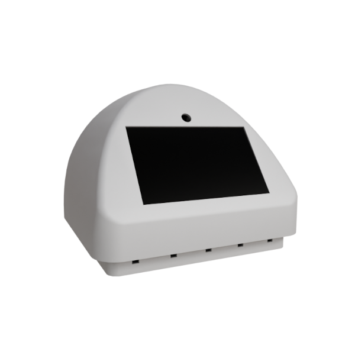
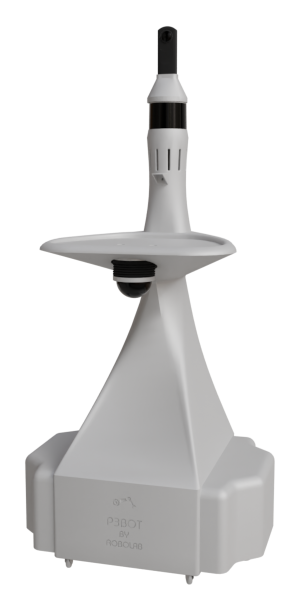
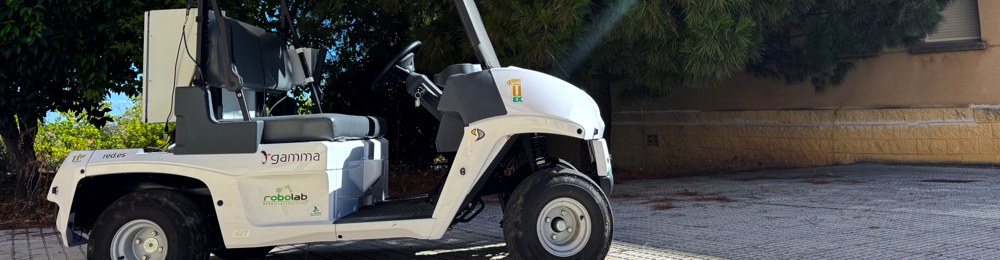

# Sergio Eslava

Robotics software engineer specialized in **robotics simulation, graphics engines and physics-based systems**, with a strong focus on the technical foundations that make complex robotic systems reliable and testable.

📍 Spain  
🌍 Open to remote work

I work at the intersection of **robotics, simulation, 3D graphics and distributed systems**, building simulators, communication layers and tooling that bridge real robots, physics engines and control software.

---

## What I specialize in

- Robotics simulation and digital twins
- Physics engines and simulation fidelity
- 3D graphics and rendering from a **programming and systems** perspective
- Integration of simulators with distributed control systems
- Communication layers between simulators, middleware and real robots
- ROS 2 system description and integration
- Unreal Engine–based simulation and VR interaction

I’m particularly interested in building **infrastructure-level software**: the systems that robotics engineers rely on to test, validate and operate robots in realistic environments.

---

## Greatest Hits

A selection of real-world robotics projects I have significantly contributed to.

### 🤖 P3Bot

Omnidirectional platform with dual Kinova Gen3 7DoF manipulators.

**My contributions:**
- Industrial design and generation of 3D meshes ready for 3D printing
- Complete robot implementation in **Webots** ([link](https://github.com/SergioEslava/webots/tree/p3bot))
  - Accepted into the official Webots robot repository
- Implementation of **Kinova Gen3 7DoF** manipulators in **Webots** ([link](https://github.com/SergioEslava/webots/tree/p3bot))
  - Accepted into the official Webots robot repository
- Design and implementation of the communication system between the simulator and the distributed control system ([Robocomp](https://github.com/robocomp/robocomp)) ([link](https://github.com/SergioEslava-UEx/webots-p3bot))
- Creation of the robot description in **URDF for ROS 2** ([link](https://github.com/SergioEslava/p3bot_description))
- Participation in the implementation of a **VR-based teleoperation system** for both manipulators using **Unreal Engine 5** ([link](https://github.com/alfiTH/VR_teleoperation))
- Co-authoring of a research paper describing the teleoperation system ([link](https://www.preprints.org/manuscript/202601.0368))

---

### 🤖 EBOv2

Educational mobile robot platform.

**My contributions:**
- Industrial design and generation of 3D meshes for 3D printing
- Complete robot implementation in **Webots** ([link](https://github.com/robocomp/webots-ebo))
- Implementation of the communication layer between the simulator and the distributed control system ([link](https://github.com/robocomp/webots-ebo/tree/main/components/ebo-bridge))
- Integration of the robot into **LearnBlock** ([link](https://github.com/robocomp/LearnBlock/blob/EBOv2/learnbot_dsl/Clients/EBOv2.py))
- Development of new functionalities for LearnBlock ([link](https://github.com/robocomp/LearnBlock/tree/EBOv2))

---

### 🤖 Shadow

Mobile robot platform.

**My contributions:**
- Industrial design and generation of 3D meshes for 3D printing
- Implementation of the communication layer between the distributed control system and the simulator ([link](https://github.com/robocomp/webots-bridge))
- Development of the communication bridge between **Gazebo** and the distributed system ([link](https://github.com/robocomp/gazebo-bridge))

---

### 🚗 Gamma Autonomous Driving Car | 5G Pilot ([link](https://www.youtube.com/watch?v=19kWHUeHW8M&t=1s))

Autonomous driving system developed in an industrial context.

**My contributions:**
- Contributed to the development of the distributed control system
- Worked on the simulator based on Unreal Engine
- Collaborated on simulation-driven validation workflows for autonomous driving

---

## Technologies & Tools

**Core stack:**
- C++, Python
- ROS 2
- Webots, Gazebo
- Unreal Engine 5, Unity 6
- Robotics simulation and physics engines
- Distributed systems and communication middleware

**Additional areas:**
- 3D modeling pipelines for simulation and manufacturing
- VR-based interaction and teleoperation
- Performance-oriented system design

---
