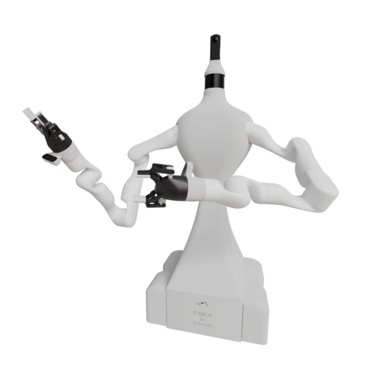

# Sergio Eslava

## Robotics Simulation & Digital Twin Engineer

📍 Spain  
🌍 Remote-friendly

I help robotics teams and companies build simulation and digital-twin infrastructure they can actually trust — so they can test faster, reduce risk, and make real decisions before touching hardware.

I work at the intersection of robotics, physics-based simulation, 3D engines and distributed systems, designing the technical foundations that make complex robotic systems testable, debuggable and scalable.

**[Webots](https://cyberbotics.com/) contributor** · Gazebo · ROS 2 · Unity · Unreal Engine · Simulation ↔ Real Robot Parity

## 

---

## What I specialize in

- Robotics simulation and digital twins
- Physics engines and simulation fidelity
- 3D graphics and rendering from a **programming and systems** perspective
- Integration of simulators with distributed control systems
- Communication layers between simulators, middleware and real robots
- ROS 2 system description and integration
- Unreal Engine–based simulation and VR interaction

My work focuses on infrastructure-level software: the systems that enable robotics engineers to move faster **without breaking things**.

---

## Greatest Hits

A selection of real-world robotics projects I have significantly contributed to.

### 🤖 P3Bot

Omnidirectional mobile manipulator platform, officially integrated into Webots (r2025b).

**My contributions:**
- Industrial design and generation of 3D meshes ready for 3D printing
- Complete robot implementation in **Webots** ([link](https://github.com/cyberbotics/webots/tree/develop/projects/robots/robolab/p3bot/protos))
  - **Accepted into the official Webots codebase (r2025b)**
- Implementation of **Kinova Gen3 7DoF** manipulators in **Webots** ([link](https://github.com/cyberbotics/webots/tree/develop/projects/robots/robolab/p3bot/protos))
  - Usable **standalone** or mounted on mobile platforms
  - **Accepted into the official Webots codebase (r2025b)**
- Definition of a **modular robot architecture** enabling interchangeable manipulators within Webots
- Design and implementation of the communication system between the **Webots** simulator and the custom distributed control system ([Robocomp](https://github.com/robocomp/robocomp)) ([link](https://github.com/SergioEslava-UEx/webots-p3bot))
- Creation of full **ROS 2 URDF description** ([link](https://github.com/SergioEslava/p3bot_description))
- Participation in the implementation of a **VR-based teleoperation system** for both manipulators using **Unreal Engine 5** ([link](https://github.com/alfiTH/VR_teleoperation))
- Co-authoring of a research paper describing the teleoperation system ([link](https://www.mdpi.com/2079-9292/15/3/572))

**Impact:**

A production-ready simulator used for development, validation and research, with consistent behavior across simulation and real robots.

---

### 🤖 EBOv2

Educational mobile robot platform.

**My contributions:**
- Industrial design and generation of 3D meshes for 3D printing
- Complete robot implementation in **Webots** ([link](https://github.com/robocomp/webots-ebo))
- Implementation of the communication layer between the **Webots** simulator and the custom distributed control system ([link](https://github.com/robocomp/webots-ebo/tree/main/components/ebo-bridge))
- Integration of the robot into **LearnBlock** ([link](https://github.com/robocomp/LearnBlock/blob/EBOv2/learnbot_dsl/Clients/EBOv2.py))
- Development of new functionalities for LearnBlock ([link](https://github.com/robocomp/LearnBlock/tree/EBOv2))

---

### 🤖 Shadow

Mobile robot platform.

**My contributions:**
- Industrial design and generation of 3D meshes for 3D printing
- Implementation of the communication layer between the custom distributed control system and the **Webots** simulator ([link](https://github.com/robocomp/webots-bridge))
- Development of the communication bridge between **Gazebo** and the distributed system ([link](https://github.com/robocomp/gazebo-bridge))

---

### 🚗 Gamma Autonomous Driving Car | 5G Pilot ([link](https://www.youtube.com/watch?v=19kWHUeHW8M&t=1s))

Autonomous driving system developed in an industrial context.

**My contributions:**
- Contributed to the development of the distributed control system
- Worked on the simulator based on Unreal Engine
- Collaborated on simulation-driven validation workflows for autonomous driving

---

## Technologies & Tools

**Core stack:**
- C++, Python
- ROS 2, custom distributed systems
- Webots, Gazebo
- Unreal Engine 5, Unity 6
- Blender, Solidworks
  
**Additional areas:**
- 3D modeling pipelines for simulation and manufacturing
- VR-based interaction and teleoperation
- Performance-oriented system design

---
